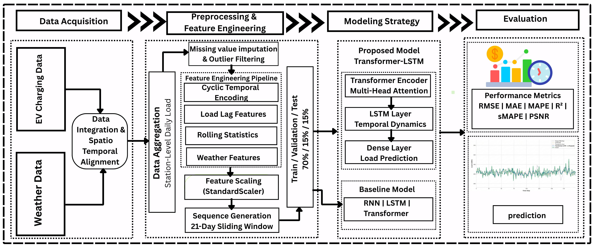

# Spatio-Temporal Forecasting of Municipal EV Charging Load Using Weather-Aware Transformer–LSTM Hybrid Models

<p align="center">
  
  
  
  
  
</p>

This repository provides an end-to-end research pipeline for forecasting daily municipal EV charging demand in New York City using weather-aware deep learning models, including a Transformer-LSTM hybrid.

## Why This Project

EV charging demand varies with time, human mobility patterns, and weather dynamics. This project builds a reproducible forecasting workflow that unifies data engineering, deep-learning model benchmarking, and interpretable evaluation in one place.

## Table of Contents

1. [Why This Project](#why-this-project)
2. [Core Features](#core-features)
3. [Data Sources](#data-sources)
4. [Methodology](#methodology)
5. [Project Structure](#project-structure)
6. [Quick Start](#quick-start)
7. [Run Options](#run-options)
8. [Outputs](#outputs)
9. [Configuration](#configuration)
10. [Results Snapshot](#results-snapshot)
11. [Troubleshooting](#troubleshooting)
12. [Contributing](#contributing)
13. [License](#license)


## Core Features

- Modular pipeline from raw CSV to final metrics and plots.
- Multi-model benchmarking: Simple RNN, LSTM, Transformer, Transformer-LSTM.
- Weather-aware and spatio-temporal feature engineering.
- Consistent metrics: R2, MAE, RMSE, MAPE, sMAPE, PSNR.
- Automatic generation of evaluation plots and summaries.

## Data Sources

- EV charging data:
  https://catalog.data.gov/dataset/electric-vehicle-ev-charging-data-municipal-lots-and-garages
- Weather data (ASOS):
  https://mesonet.agron.iastate.edu/request/download.phtml?network=NY_ASOS

Default raw input files expected by the code:

- Data/Electric_Vehicle__EV__Charging_Data-_Municipal_Lots_and_Garages.csv
- Data/asos.csv

## Methodology

The model predicts daily load for each station using historical charging behavior and weather context over a fixed lookback window.

$$
y_{t,s} = f(X_{t-\tau:t-1,s}, W_{t-\tau:t-1,s}), \quad \tau=21
$$

Main pipeline stages:

1. EV + ASOS cleaning
2. Feature engineering (temporal, lag, rolling, EMA)
3. Sequence dataset creation and temporal train/val/test split
4. Multi-model training
5. Evaluation and visualization

## Project Structure

```text
Project-EV/
├── ⚙️ configs/
│   └── 📄 config.py
├── 🗂️ Data/
├── 🖼️ figure/
├── 📊 results/
│   ├── EDA Plot/
│   ├── evaluation plot/
│
├── 🚀 scripts/
│   └── run_pipeline.py
├── 🧠 src/
│   ├── data/
│   ├── models/
│   ├── training/
│   ├── evaluation/
│   └── visualization/
├── ▶️ main.py
└── 📦 requirements.txt
```

Architecture diagram:



## Quick Start

### Option A: Conda

```bash
conda create -n ev python=3.10 -y
conda activate ev
pip install -r requirements.txt
```

### Option B: venv (Windows)

```bash
python -m venv .venv
.venv\Scripts\activate
pip install -r requirements.txt
```

## Run Options

### Full pipeline (recommended)

```bash
python main.py
```

### Script entry with control flags

```bash
python scripts/run_pipeline.py
python scripts/run_pipeline.py --skip-data
python scripts/run_pipeline.py --skip-train
```

## Outputs

The current implementation writes fresh outputs to:

- outputs/model_comparison_results.csv
- outputs/figures/

Historical experiment artifacts are also available under:

- results/

Generated visualizations include:

- loss curves,
- actual vs predicted,
- all-model overlay,
- scatter and residual diagnostics,
- uncertainty intervals,
- temporal-scale and peak-load analysis,
- station-level average comparisons.

## Configuration

All major settings are centralized in configs/config.py:

- data paths,
- sequence length,
- train/val/test split,
- learning rate and epochs,
- feature list,
- station-to-weather mapping,
- date filter range.

For reproducible runs, keep seed and split settings fixed across experiments.

## Results Snapshot

In the latest report, Transformer-LSTM shows the strongest overall performance among compared models.

### Quantitative Comparison (Test Set)

```text
═════════════════════════════════════════════════════════════════════════════════════
  Model                       R²      MAE     RMSE    MAPE%    sMAPE%   PSNR(dB)
─────────────────────────────────────────────────────────────────────────────────────
  Simple RNN              0.9012 144.5764 226.7971    25.53   22.6510    19.8963
  LSTM                    0.9215 128.5463 202.1594    26.42   21.6714    20.8952
  Transformer             0.9408 112.2351 175.5577    23.74   19.2181    22.1207
  Transformer-LSTM        0.9731  77.0074 118.3410    17.58   14.2923    25.5464  ◀
```

### Prediction Plot


Reference summary table file:

- results/model_comparison_results.csv

## Troubleshooting

- CUDA not available:
  Training automatically falls back to CPU.
- Missing file errors:
  Verify dataset file names and paths in configs/config.py.
- Weak model performance:
  Check date filters, feature completeness, and location sample counts.

## Contributing

Contributions are welcome.

Please include:

- a clear problem statement,
- steps to reproduce,
- and a concise explanation of changes.

## License

This project is licensed under the MIT License.

---

## Author

MD Uzzal Mia  
Information and Communication Engineering  
Pabna University of Science and Techonoloy  
Email: uzzal.220605@s.pust.ac.bd
- `Data/EV_Charging_Cleaned.csv` - Cleaned EV data (211,324 rows)
- `Data/Final_EV_Dataset.csv` - Merged EV + weather data (630,002 rows)

---

## Key Statistics

| Metric | Value |
|--------|-------|
| EV Data Rows | 211,324 |
| ASOS Data Rows | 4,683 |
| Merged Dataset Rows | 630,002 |
| Merge Ratio | 2.98 rows per EV record |
| Weather Stations | 3 (NYC, LGA, JRB) |
| Date Range | 2021-07-31 to 2025-12-15 |
| **Dates with 3 stations** | 1,485 |
| **Dates with 2 stations** | 114 |

---

## Column Descriptions

### EV Charging Columns
| Column | Description |
|--------|------------|
| `Date` | Date of charging |
| `Station ID` | Unique charging station identifier |
| `Location Name` | Physical location of charging station |
| `Connected Time` | Time when vehicle connected to charger |
| `Disconnected Time` | Time when vehicle disconnected |
| `Charge Duration (min)` | Duration of charging in minutes |
| `Connected Duration (min)` | Total connection duration |
| `Energy Provided (kWh)` | Energy delivered in kilowatt-hours |

### Weather Columns
| Column | Description | Unit/Type |
|--------|------------|------------|
| `station` | Weather station code (NYC/LGA/JRB) | String |
| `tmpf` | Average temperature | °F |
| `relh` | Average relative humidity | % |
| `feel` | Average feels-like temperature | °F |
| `sped` | Average wind speed | mph |
| `p01m` | Total precipitation | inches |
| `snowdepth` | Snow depth presence (0=absent, 1=present) | Binary |

---

## Files Generated
- ✅ `Data/EV_Charging_Cleaned.csv`
- ✅ `Data/ASOS_Cleaned.csv`
- ✅ `Data/Final_EV_Dataset.csv`

---

## Data Quality Notes

1. **EV Data:** Cleaned from missing values and filtered to specific date range
2. **ASOS Data:** Aggregated from hourly to daily, standardized across 3 stations
3. **Merge:** LEFT JOIN preserves all EV records; weather data aligned by date
4. **Missing Weather:** Some dates have only 2 out of 3 weather stations available

---

---

## Analysis Ready

The `Final_EV_Dataset.csv` file is now ready for:
- Exploratory Data Analysis (EDA)
- Correlation analysis between charging patterns and weather
- Predictive modeling
- Statistical analysis

---

## Project Structure
```
Project-EV/
├── README.md                          (Project documentation)
├── EV_Charging_Analysis.ipynb         (Main analysis notebook)
├── requirements.txt                   (Python package dependencies)
└── Data/
    ├── Electric_Vehicle__EV__Charging_Data-_Municipal_Lots_and_Garages.csv
    ├── asos.csv
    ├── asos_daily_cleaned.csv
    ├── EV_Charging_Cleaned.csv
    ├── ASOS_Cleaned.csv
    └── Final_EV_Dataset.csv
```

---

**Last Updated:** February 28, 2026
**Status:** ✅ Data Cleaning & Merging Complete
=======
>>>>>>> Stashed changes
